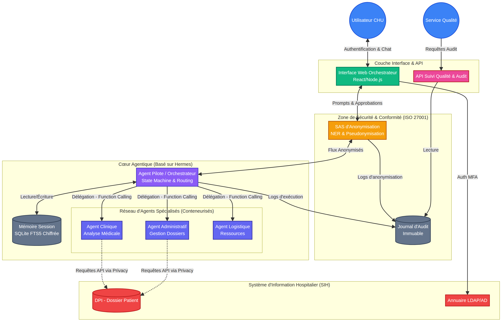

<div align="center">

# ☤ HERMES CHU

### Système Agentique Hospitalier Souverain

<br/>



<br/>

[](https://github.com/Tarzzan/HERMES-CHU/blob/main/docs/wiki/06-Conformite-ISO-27001.md)
[](https://github.com/Tarzzan/HERMES-CHU/blob/main/docs/wiki/05-SAS-Anonymisation.md)
[](https://github.com/NousResearch/hermes-agent)
[](LICENSE)

---

**Orchestration multi-agents IA pour Centre Hospitalier Universitaire**  
*Anonymisation traçable • Garde-fous médicaux • Interface de pilotage • APIs Qualité*

[📖 Wiki Complet](https://github.com/Tarzzan/HERMES-CHU/wiki) · [🗺️ Roadmap](https://github.com/Tarzzan/HERMES-CHU/milestones) · [📋 Issues](https://github.com/Tarzzan/HERMES-CHU/issues)

</div>

---

## 🎯 Vision

**HERMES CHU** est le système nerveux numérique d'un Centre Hospitalier Universitaire. Il ne s'agit pas d'un chatbot, mais d'un **orchestrateur multi-agents autonome** capable de décomposer des tâches complexes, de déléguer à des agents spécialisés, et de s'auto-améliorer — le tout dans un cadre de sécurité et de conformité réglementaire maximal.

Le système est construit **directement sur le code source** de [hermes-agent (NousResearch)](https://github.com/NousResearch/hermes-agent), intégré dans `upstream/hermes-agent/`. La couche CHU (`chu/`) s'y greffe de manière non-destructive via un système de middleware et de skills natifs, sans modifier le code source original.

> **Pour le POC** : le Privacy Engine RGPD anonymise les données PHI avant tout envoi, ce qui permet d'utiliser Azure OpenAI ou OpenAI en toute conformité RGPD, sans attendre l'infrastructure vLLM on-premise de production.

---

## 🏗️ Architecture en 5 Couches

```
┌─────────────────────────────────────────────────────────────────────┐
│  COUCHE 1 — PRÉSENTATION                                            │
│  Interface Web Orchestrateur │ App Qualité │ API Gateway SIH        │
├─────────────────────────────────────────────────────────────────────┤
│  COUCHE 2 — SÉCURITÉ & CONFORMITÉ (ISO 27001 / HDS)                │
│  SAS Anonymisation │ Garde-Fous 4 niveaux │ RBAC/MFA │ Audit       │
├─────────────────────────────────────────────────────────────────────┤
│  COUCHE 3 — ORCHESTRATION (Hermes Core Modifié)                     │
│  Agent Pilote │ State Machine │ Function Calling │ Mémoire          │
├─────────────────────────────────────────────────────────────────────┤
│  COUCHE 4 — AGENTS SPÉCIALISÉS (Conteneurisés)                      │
│  Clinique │ Administratif │ Logistique │ Recherche │ Qualité        │
├─────────────────────────────────────────────────────────────────────┤
│  COUCHE 5 — SYSTÈMES HOSPITALIERS                                    │
│  DPI (FHIR) │ GAM │ SIL │ PACS │ LDAP/AD                           │
└─────────────────────────────────────────────────────────────────────┘
```

---

## 🔐 Principes Non-Négociables

| Principe | Description |
| :--- | :--- |
| **Souveraineté totale** | Aucune donnée ne quitte l'infrastructure HDS. LLM hébergé localement. |
| **Transparence** | Chaque décision de l'agent est traçable et auditable. |
| **Humain dans la boucle** | Toute action critique nécessite une validation explicite. |
| **Anonymisation par défaut** | Le LLM ne traite jamais de données nominatives. |
| **Francisation complète** | Interface, prompts, documentation — tout en français. |

---

## 📁 Structure du Projet

```
HERMES-CHU/
├── upstream/                          ← Code source NousResearch (INCHANGÉ)
│   ├── hermes-agent/                  # hermes-agent complet (NousResearch)
│   │   ├── agent/                     # Boucle agentique, model registry
│   │   ├── web/                       # Interface React (avec i18n/fr.ts)
│   │   ├── tools/                     # Outils natifs hermes
│   │   ├── gateway/                   # Gateway Telegram/Discord/API
│   │   └── hermes_cli/                # CLI hermes
│   └── hermes-function-calling/       # Function calling NousResearch
│
├── chu/                               ← Couche hospitalière (AJOUTS CHU)
│   ├── config_chu.yaml                # Config LLM + Privacy + Agents
│   ├── installer_chu.sh               # Installation + démarrage (--poc | --production)
│   ├── privacy_engine/
│   │   ├── middleware.py              # Privacy Engine RGPD (NER + Glass-Break)
│   │   └── patch_hermes.py            # Patch non-destructif sur hermes-agent
│   ├── api/
│   │   └── serveur_chu.py             # API FastAPI (config LLM, privacy, audit)
│   ├── web-extensions/
│   │   └── src/pages/
│   │       └── ConfigurationCHU.tsx   # Page admin React (s'intègre dans hermes web)
│   └── skills/                        # Agents CHU (format natif hermes-agent)
│       ├── agent_clinique.md
│       ├── agent_administratif.md
│       ├── agent_logistique.md
│       ├── agent_recherche.md
│       └── agent_qualite.md
│
├── docs/
│   ├── wiki/                          # Documentation technique (12 pages)
│   ├── securite/                      # Rapport ISO 27001, pentest
│   └── website/                       # Page web de présentation
│
├── .env.chu.exemple                   # Template de configuration
├── SECURITY_POLICY.md
└── CONTRIBUTING.md
```

---

## 🗺️ Roadmap

| Phase | Durée | Objectif |
| :--- | :--- | :--- |
| **Phase 1 — Fondations** | Mois 1-3 | Infrastructure, LLM local, orchestrateur de base |
| **Phase 2 — Sécurité** | Mois 4-6 | SAS anonymisation, garde-fous, audit ISO 27001 |
| **Phase 3 — Agents** | Mois 7-9 | Sous-agents spécialisés, function calling, intégration SIH |
| **Phase 4 — Interface** | Mois 10-12 | Interface web, APIs qualité, dashboard |
| **Phase 5 — Pilote** | Mois 13-15 | Déploiement 2 services, tests utilisateurs |
| **Phase 6 — Production** | Mois 16+ | Extension multi-services, certification, amélioration continue |

➡️ [Voir la roadmap détaillée (Milestones)](https://github.com/Tarzzan/HERMES-CHU/milestones)

---

## 📖 Documentation

La documentation complète est disponible dans le [Wiki](https://github.com/Tarzzan/HERMES-CHU/wiki) :

1. [Accueil & Vision](https://github.com/Tarzzan/HERMES-CHU/blob/main/docs/wiki/01-Accueil.md)
2. [Architecture Technique](https://github.com/Tarzzan/HERMES-CHU/blob/main/docs/wiki/02-Architecture-Technique.md)
3. [Cœur Agentique Hermes](https://github.com/Tarzzan/HERMES-CHU/blob/main/docs/wiki/03-Coeur-Agentique.md)
4. [Réseau d'Agents Spécialisés](https://github.com/Tarzzan/HERMES-CHU/blob/main/docs/wiki/04-Agents-Specialises.md)
5. [SAS d'Anonymisation](https://github.com/Tarzzan/HERMES-CHU/blob/main/docs/wiki/05-SAS-Anonymisation.md)
6. [Conformité ISO 27001](https://github.com/Tarzzan/HERMES-CHU/blob/main/docs/wiki/06-Conformite-ISO-27001.md)
7. [Garde-Fous & Sécurité](https://github.com/Tarzzan/HERMES-CHU/blob/main/docs/wiki/07-Garde-Fous.md)
8. [Interface Web de Pilotage](https://github.com/Tarzzan/HERMES-CHU/blob/main/docs/wiki/08-Interface-Web.md)
9. [APIs Suivi Qualité](https://github.com/Tarzzan/HERMES-CHU/blob/main/docs/wiki/09-APIs-Qualite.md)
10. [Déploiement & Infrastructure](https://github.com/Tarzzan/HERMES-CHU/blob/main/docs/wiki/10-Deploiement.md)
11. [Roadmap Détaillée](https://github.com/Tarzzan/HERMES-CHU/blob/main/docs/wiki/11-Roadmap.md)

---

## ⚡ Démarrage Rapide (POC)

```bash
# 1. Cloner le dépôt
git clone https://github.com/Tarzzan/HERMES-CHU.git
cd HERMES-CHU

# 2. Configurer les variables d'environnement
cp .env.chu.exemple .env.chu
# Éditer .env.chu avec votre clé Azure OpenAI ou OpenAI

# 3. Installer hermes-agent + couche CHU et démarrer
chmod +x chu/installer_chu.sh
./chu/installer_chu.sh --poc

# 4. Démarrer l'interface web hermes
hermes web
# → http://localhost:3000  (interface hermes-agent avec config CHU)
# → http://localhost:8001/api/chu/docs  (API CHU)
```

> **Principe RGPD** : Le Privacy Engine est actif par défaut. Toutes les données PHI (NIR, IPP, noms, adresses...) sont anonymisées avant envoi au LLM. Le mode Glass-Break permet une désactivation temporaire tracée et justifiée.

---

## 🤝 Contribution

Ce projet est développé en interne pour le CHU. Les contributions sont gérées via les [Issues](https://github.com/Tarzzan/HERMES-CHU/issues) et les Pull Requests avec revue obligatoire.

---

<div align="center">

*Projet HERMES CHU — Système Agentique Hospitalier Souverain*  
*Basé sur [Hermes Agent](https://github.com/NousResearch/hermes-agent) par [NousResearch](https://nousresearch.com)*

</div>
